# 🎥 Kỹ Năng Tự Động Hóa & Điều Khiển vMix (DaliSports Pipeline)

Kỹ năng này chuẩn hóa toàn bộ kiến thức, kinh nghiệm thực chiến và bộ lệnh điều khiển phần mềm **vMix** trong hệ thống sản xuất livestream thể thao của **DaliSports**.

---

## 🎯 Khi Nào Sử Dụng Skill Này?
- Xây dựng hoặc sửa lỗi file **Preset vMix (`preset.vmix`)** cho các giải đấu (Cầu lông, Pickleball, Tennis, Bóng đá...).
- Tự động hóa nạp tài nguyên giải đấu vào vMix: Camera, Micro, Backdrop màn hình chờ, Logo nhà tài trợ, Video TVC, Bảng điểm web, Title khách mời.
- Điều khiển vMix từ xa qua **vMix Web API (Port 8088)**: Chuyển cảnh, bật/tắt Overlay bảng điểm, cập nhật nội dung Title động, nạp Stream Key và Start/Stop Live.
- Khắc phục các lỗi phổ biến của vMix: Lỗi định dạng Preset ("preset lỗi"), xung đột thiết bị phần cứng, lệch bus âm thanh, sai format XML.

---

## ⚠️ BÀI HỌC XƯƠNG MÁU: Cấu Trúc Native XML Preset vMix

> [!CAUTION]
> **TUYỆT ĐỐI KHÔNG** tự tạo thẻ XML giả lập như `<Preset version="27.0.0.0"><Inputs><Input...>`!
> vMix **CHỈ CHẤP NHẬN** cấu trúc XML độc quyền nguyên bản của vMix. Nếu file không đúng chuẩn này, vMix sẽ báo `XML Error` hoặc mở ra các input Blank trống rỗng.

### 1. Cấu Trúc Native vMix XML Chuẩn (Version 9)
```xml
<XML>
  <Version>9</Version>
  <ZoomManager />
  <!-- Danh sách các Input trực thuộc thẻ gốc <XML> -->
  <Input Type="5" Title="UGREEN HDMI Capture" ...>
  </Input>
  <Input Type="5000" Title="BẢNG ĐIỂM" ...>https://biamanhbeo.top/bangdiem2</Input>
  <Input Type="7" Title="Audio Microphone" ...></Input>
  <Input Type="9000" Title="Khach Moi - TriColor v2.gtzip" ...>E:\Vmix\Khach Moi - TriColor v2.gtzip</Input>

  <!-- Cấu hình luồng phát trực tiếp -->
  <StreamingSettings SelectedIndex="0">
    <StreamingSetting>
      <StreamingType>10</StreamingType>
      <EncodeWidth>1920</EncodeWidth>
      <EncodeHeight>1080</EncodeHeight>
      <VideoDataRate>6000</VideoDataRate>
      <Destination0><URL>rtmps://live-api-s.facebook.com:443/rtmp</URL><Stream>STREAM_KEY</Stream>...</Destination0>
    </StreamingSetting>
  </StreamingSettings>
</XML>
```

### 2. Bảng Mã Input Types trong vMix
| Type Code | Tên Input | Mô Tả & Cách Khai Báo |
| :--- | :--- | :--- |
| **`5`** | **Camera / Capture Card** | Thiết bị DirectShow (UGREEN HDMI Capture, Camlink, Webcam). |
| **`7`** | **Audio Microphone** | Nguồn âm thanh phần cứng WASAPI/DirectSound. |
| **`9000`** | **GT Title (`.gtzip`)** | Đồ họa động vMix GT Title (Có thuộc tính `XML="<items>..."`). |
| **`5000`** | **Browser / Web Overlay** | URL trang web (Bảng điểm HTML5, Logo rotating HTML). |
| **`1`** | **Image / Photo** | Ảnh tĩnh Backdrop, Khung viền PNG (Giá trị text là đường dẫn ảnh). |
| **`0`** | **Video** | File video MP4/MOV quảng cáo, Intro, Stinger. |
| **`13`** | **Audio File** | Nhạc nền BGM MP3/WAV. |
| **`3000` / `3001`** | **Instant Replay A / B** | Hệ thống quay chậm Instant Replay của vMix. |

---

## 🛠️ Quy Trình Dựng Preset Tự Động (Master Template Pattern)

Để đảm bảo không bao giờ bị lỗi Preset, giải pháp chuẩn mực là:
1. **Lưu một Preset Master chuẩn** đã được setup hoàn chỉnh phần cứng trên máy:
   - File gốc: `D:\vmix\utc\UTC-DALI-DEFAULT.vmix`
   - File template kho: `templates/vmix/master_template.vmix`
2. **Sử dụng `system/vmix_preset_builder.py`** để đọc Master Template bằng `xml.etree.ElementTree`:
   - Gán đường dẫn Backdrop thực tế vào Input 7 (`man-hinh-cho.jpg`).
   - Nạp Input 9: Title Khách Mời (`Khach Moi - TriColor v2.gtzip`).
   - Cập nhật Stream URL & Stream Key vào thẻ `<Destination0>`.
   - Xuất ra `livestream/preset.vmix` tương ứng cho từng giải đấu.

---

## 📡 vMix Web API Cheat Sheet (Port 8088)

vMix tích hợp sẵn Web Server tại địa chỉ: `http://127.0.0.1:8088/api/`.

### 1. Kiểm Tra Trạng Thái & Lấy Dữ Liệu XML
```bash
# Lấy toàn bộ trạng thái vMix (Active, Preview, Inputs, Streaming, Volume)
curl -s http://127.0.0.1:8088/api/
```

### 2. Bộ Lệnh Quản Lý Input & Chuyển Cảnh
| Mục Đích | Lệnh API (GET Request) |
| :--- | :--- |
| **Thêm File Input** | `/api/?Function=AddInput&Value=Title\|E:\Vmix\Title.gtzip`<br>*(Chỉ hỗ trợ file Video, Image, Title, Audio. Không hỗ trợ Camera phần cứng trực tiếp).* |
| **Đổi Vị Trí Input** | `/api/?Function=MoveInput&Input=InputNameOrNumber&Value=1` |
| **Chuyển Cảnh Cut** | `/api/?Function=Cut` |
| **Chuyển Cảnh Fade** | `/api/?Function=Fade&Duration=500` |
| **Chuyển Cảnh Merge** | `/api/?Function=Merge&Duration=700` |
| **Đưa Input lên Preview** | `/api/?Function=PreviewInput&Input=1` |
| **Đưa Input lên Active** | `/api/?Function=ActiveInput&Input=1` |

### 3. Bộ Lệnh Title & Đồ Họa Động (Dynamic Title / Scoreboard)
```bash
# Cập nhật chữ trong Text Field của GT Title
http://127.0.0.1:8088/api/?Function=SetText&Input=Khach Moi - TriColor v2.gtzip&SelectedName=GuestName.Text&Value=NGUYEN+VAN+A

# Cập nhật ảnh / logo trong Title
http://127.0.0.1:8088/api/?Function=SetImage&Input=Khach Moi - TriColor v2.gtzip&SelectedName=Logo Image.Source&Value=E:\Logo\sponsor.png

# Bật Overlay 1 (ví dụ thanh tên khách mời hoặc bảng điểm)
http://127.0.0.1:8088/api/?Function=OverlayInput1In&Input=Khach Moi - TriColor v2.gtzip

# Tắt Overlay 1
http://127.0.0.1:8088/api/?Function=OverlayInput1Out&Input=Khach Moi - TriColor v2.gtzip
```

### 4. Bộ Lệnh Quản Lý Luồng Livestream
```bash
# Cài đặt Stream URL (Channel 1)
http://127.0.0.1:8088/api/?Function=StreamingSetURL&Value=rtmps://live-api-s.facebook.com:443/rtmp&SelectedName=1

# Cài đặt Stream Key (Channel 1)
http://127.0.0.1:8088/api/?Function=StreamingSetKey&Value=FB-YOUR-STREAM-KEY&SelectedName=1

# Bắt đầu phát sóng (Start Live)
http://127.0.0.1:8088/api/?Function=StartStreaming&Value=1

# Dừng phát sóng (Stop Live)
http://127.0.0.1:8088/api/?Function=StopStreaming&Value=1
```

---

## 🎯 Bố Cục Input Mẫu Chuẩn DaliSports Studio

```mermaid
graph TD
    IN1["#1: Camera 1 (UGREEN HDMI Capture)"] --> LIVE["MASTER LIVE OUTPUT"]
    IN2["#2: Bảng Điểm Web (Browser biamanhbeo.top)"] --> OV1["Overlay 1"]
    IN3["#3: Khung Viền PNG (dali-livestream-cl.png)"] --> OV2["Overlay 2"]
    IN4["#4: Logo Tài Trợ Web (pp.biamanhbeo.top)"] --> OV3["Overlay 3"]
    IN5["#5: Microphone (WASAPI Audio)"] --> AUDIO["Master Audio Bus M"]
    IN6["#6: Stinger (DALI.mp4)"] --> TRANS["Transition Effect"]
    IN7["#7: Backdrop Chờ (Ảnh giải đấu)"] --> PREVIEW["Waiting Screen"]
    IN8["#8: Nhạc Nền (bg-music-dali.mp3)"] --> AUDIO
    IN9["#9: Title Khách Mời (TriColor v2.gtzip)"] --> OV4["Overlay 4"]
    IN10["#10 & #11: Replay A & B"] --> REPLAY["Chậm pha bóng đẹp"]
```


---

## 💡 Best Practices Khi Vận Hành Tự Động
1. **Luôn kiểm tra Web API trước khi gửi lệnh**: Gọi `GET http://127.0.0.1:8088/api` timeout 2s để xác nhận vMix đang mở và không bị đơ.
2. **Quản lý Encoding URL cẩn thận**: Các giá trị có khoảng trắng hoặc tiếng Việt (tên VĐV, tên giải) bắt buộc phải qua `urllib.parse.quote` hoặc `encodeURIComponent`.
3. **Không gọi `SavePreset` dồn dập qua API**: Chỉ lưu khi cần chốt cấu hình để tránh lock I/O của vMix lúc đang tải đồ họa nặng.
